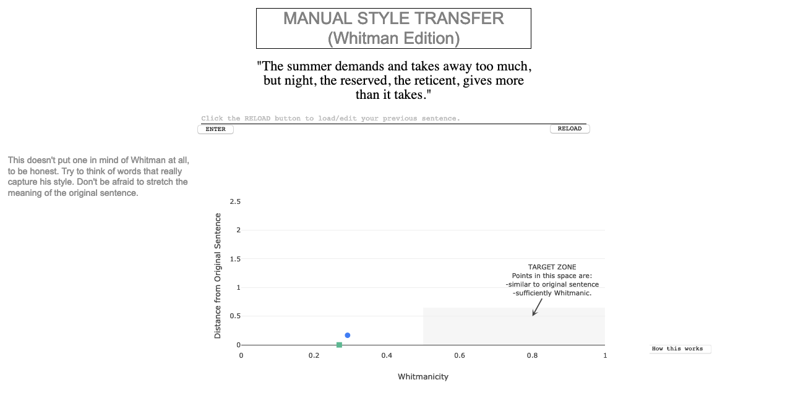

# Manual Style Transfer

Style Transfer is a computational task in which the style of one author or discourse is projected onto a text.

Manual Style Transfer is an interface that directs the writer to manually transform a sentence to be (in this case) more Whitmanic. A classifier trained to distinguish between authors is used to judge Whitmanicity.  Word Mover's Distance (Kusner, 2015) is used to keep track of semantic distance from the original sentence.  

You can try it [here](https://manualstyletransfer.herokuapp.com/) (may take a minute or so to load). 

Originally presented in the 2018 exhibition of the Electronic Literature Organization, Montréal. 